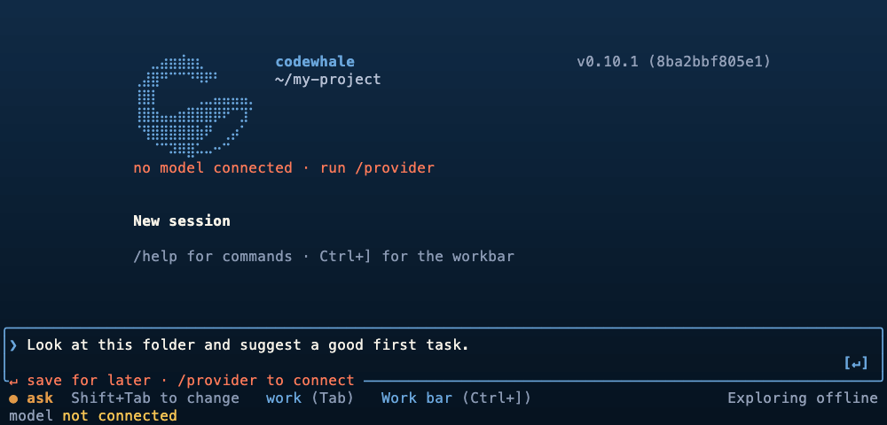

<!-- source: README.md sha256:604da19bff2c -->
<div align="center">

<picture>
  <source media="(prefers-color-scheme: dark)" srcset="brand/wordmark-inverted.svg">
  
</picture>

**支持任意模型的开源编码智能体。**

Codewhale 会读取你的项目、编辑文件、运行命令并检查自己的工作——
在你的终端中，使用你选择的托管模型或本地模型。

[](https://github.com/codewhale-hq/CodeWhale/actions/workflows/ci.yml)
[](https://crates.io/crates/codewhale-cli)
[](https://www.npmjs.com/package/codewhale)
[](LICENSE)
[](https://discord.gg/37gfS3ksug)

[官网](https://codewhale.net) · [文档](docs/README.md) · [更新日志](CHANGELOG.md) · [参与贡献](CONTRIBUTING.md)

[English](README.md) · [日本語](README.ja-JP.md) · [Tiếng Việt](README.vi.md) · [Bahasa Indonesia](README.id.md) · [한국어](README.ko-KR.md) · [Español](README.es-419.md) · [Português](README.pt-BR.md) · [Русский](README.ru.md) · [Українська](README.uk.md) · [Français](README.fr.md) · [Deutsch](README.de.md) · [繁體中文](README.zh-TW.md) · [हिन्दी](README.hi.md) · [Türkçe](README.tr.md) · [Italiano](README.it.md) · [Polski](README.pl.md) · [العربية](README.ar.md) · [Català](README.ca.md)



<sub>全新安装后的真实终端截图——未经任何摆拍。</sub>

</div>

## 安装

macOS 和 Linux：

```bash
curl -fsSL https://codewhale.net/install.sh | sh
```

安装器会将经过校验和验证的二进制文件下载到 `~/.local/bin`。如果之后运行
`codewhale` 提示 "command not found"，请运行安装器打印出的那一行 PATH 命令，或参阅
[将它加入 PATH](docs/INSTALL.md#put-it-on-your-path)。
随时可以通过 `codewhale update` 升级。

<details>
<summary><b>Windows、npm、Cargo 及其他安装方式</b></summary>

```bash
winget install HunterBown.CodeWhale  # Windows x64 (or Scoop, or the installer from GitHub Releases)
npm install -g codewhale            # wraps the same release binaries
cargo install codewhale-cli --locked  # build from crates.io
```

Docker、Nix、Linux 上的 Homebrew、Android/Termux、带校验和验证的手动下载，
以及可选的 CNB 镜像，都在[安装指南](docs/INSTALL.md)中说明。请只选择一种方式：
同一台机器上安装多份，最终会在 `PATH` 上互相冲突。

</details>

## 快速开始

1. **打开你的项目。** 在要处理的文件夹中运行 `codewhale`。
2. **连接模型。** 运行 `/provider`（或按 `F3`）添加托管服务的密钥，或选择本地运行时。
   如果 Ollama 已在运行并带有聊天模型，Codewhale 会自动切换到它。使用 `/model` 更换模型。
3. **给它一个具体的任务。**

```text
Fix the failing tests and explain what changed.
```

同一任务也可以在脚本或 CI 作业中以无界面方式运行：

```bash
codewhale exec "fix the failing tests and explain what changed"
```

运行 `/help` 查看命令和键盘快捷键。

## 运行方式

所有客户端都驱动同一个本地 Codewhale Runtime，因此会话、工具和权限在各处的行为一致。

| 命令 | 作用 |
| --- | --- |
| `codewhale` | 交互式终端界面 |
| `codewhale exec "…"` | 在脚本或 CI 中执行一次无界面对话轮次，以流式 JSON 输出 |
| `codewhale web` | 内置的[本地浏览器客户端](docs/WEB.md)，监听 `127.0.0.1` |
| `codewhale review --pr N` | 仅供参考的[拉取请求审查](docs/GITHUB_ACTION.md)；是否发布评论需主动开启 |
| Runtime API | 用于线程、事件和审批的[本地 HTTP API](docs/RUNTIME_API.md) |

原生桌面应用（GPUI）正在作为需登录的产品客户端开发中；开放情况见
[产品页面](https://codewhale.net/en/product)。由社区维护的
[VS Code 扩展](https://marketplace.visualstudio.com/items?itemName=HengQuWorld.brotherwhale-vscode)
可在侧边栏中连接同一个 Runtime（[源码](https://github.com/HengQuWorld/CodeWhale-VSCode)）。

## 功能

- **任意模型，不被锁定。** 内置超过 40 条提供商路由——Anthropic、DeepSeek、Google、
  Mistral、Moonshot、OpenAI、OpenRouter、xAI 等——还支持任何兼容 OpenAI 的端点，
  以及通过 Ollama、vLLM 或 SGLang 运行的本地模型。[提供商](docs/PROVIDERS.md)
- **由你掌控。** Plan 模式只探索、不做任何改动；Work 和 Operate 会进行修改。
  审批姿态决定工具调用何时需要你的确认，`/undo` 和 `/restore` 可恢复工作区改动，
  `/receipts` 会列出一次会话中的每个文件、命令和审批。[模式](docs/MODES.md) ·
  [回执](docs/RECEIPTS.md)
- **为长时间任务而设计。** 设定持久的 `/goal`，把有边界的工作委派给
  [子智能体](docs/SUBAGENTS.md)，运行带有预算检查的受监督[智能体团队](docs/FLEET.md)，
  或将它们编写为可纳入版本库的[工作流](docs/WORKFLOW_AUTHORING.md)。
- **扩展你已在使用的工具。** 连接 [MCP 服务器](docs/MCP.md)，安装
  [技能](docs/SKILLS.md)和[插件](docs/PLUGINS.md)，在会话和工具事件上运行
  [钩子](docs/HOOKS.md)，并加载现有的 [Claude Code 插件](docs/CLAUDE_PLUGIN_COMPAT.md)。
- **Computer Use。** 内置插件提供观察和操作其他应用的工具。使用前请先查看其访问范围并启用。
  [指南](crates/tui/plugins/computer-use/README.md)

## 模式与权限

| | 切换方式 | 选项 |
| --- | --- | --- |
| **模式（Mode）**——智能体正在做什么 | `Tab` 或 `/mode` | Plan（探索，不做改动）· Work（编辑并运行）· Operate（通过有计划、可验证的步骤推进一个目标） |
| **姿态（Posture）**——何时先征求同意 | `Shift+Tab` | Ask · Auto-Review · Full Access |

Full Access 仍然遵守硬性策略边界。
[模式与权限指南](docs/MODES.md)对每个选项都有说明。

## 安全

Codewhale 在你的机器上运行，只拥有你授予它的访问权限。审批姿态和仓库规则会限制智能体可以做的事，
在支持的平台上，命令会在操作系统沙箱中运行（macOS 上为 Seatbelt；Linux 上的 bubblewrap 需主动启用）。
`/preview-request` 会在发送任何内容之前显示经过脱敏的完整请求。
未知的模型价格会保持"未知"，而不会被报告为免费。

参见[授权顺序](docs/AUTHORIZATION_ORDER.md)、
[沙箱](docs/SANDBOX.md)和[遥测](docs/TELEMETRY.md)——使用量计数默认开启，
运行 `codewhale config set telemetry false` 即可关闭。

## 文档

| 从这里开始 | 深入了解 |
| --- | --- |
| [安装](docs/INSTALL.md) | [配置](docs/CONFIGURATION.md) |
| [提供商与本地模型](docs/PROVIDERS.md) | [架构](docs/ARCHITECTURE.md) |
| [模式与权限](docs/MODES.md) | [Runtime API](docs/RUNTIME_API.md) |
| [快捷键](docs/KEYBINDINGS.md) | [插件开发](docs/PLUGIN_AUTHORING.md) |
| [GitHub PR 审查](docs/GITHUB_ACTION.md) | [全部文档](docs/README.md) |

## 社区

欢迎提交缺陷报告、功能想法和拉取请求——无论你已使用 Codewhale 数月，还是第一次尝试。
如果缺少某个提供商，或某个工作流不顺手，
请[提交 issue](https://github.com/codewhale-hq/CodeWhale/issues/new/choose)或
[发送拉取请求](CONTRIBUTING.md)。欢迎首次贡献，
被合并的工作会保留贡献者的署名。
[仓库结构](CONTRIBUTING.md#project-structure)是一个不错的起点。

欢迎加入 [Discord](https://discord.gg/37gfS3ksug)，或在微信上添加 Hunter
（`hunterbown`），申请加入 Whale Brothers 群。

## 历史与许可证

Codewhale 最初名为 `deepseek-tui`，至今仍会读取该项目的配置和会话。
它现在与具体提供商无关，由独立团队维护，与任何模型提供商均无隶属关系。
感谢[每一位贡献者](docs/CONTRIBUTORS.md)，以及帮助它成长的开源社区。

[MIT](LICENSE)。改编自其他开源项目的部分记录在
[第三方声明](docs/THIRD_PARTY_NOTICES.md)中。
